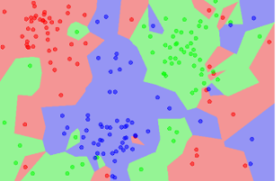
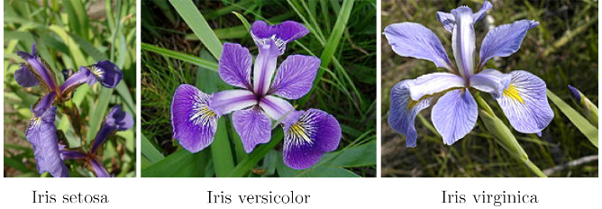
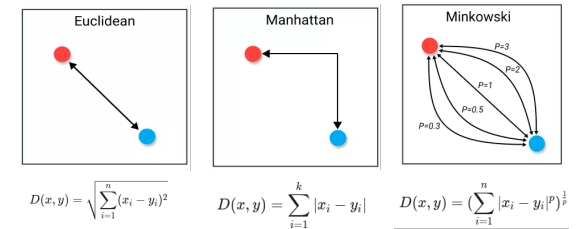

# Hi, I'm Hoang! 👋

## 🚀 About Me
Em là Giang Lê Hoàng lớp CNTT02 K18 trường Đại học Công Nghiệp, hiện đang hoạt động tại lab 601!

# Chủ đề nghiên cứu!

## Ứng dụng thuật toán K-nearst neighbors trên bộ dữ liệu iris (bộ dữ liêu các loài hòa)

## 🛠 Skills
python

## I.Giới thiệu chung:
### 1.Khái niệm
 K-nearest neighbor là một trong những thuật toán supervised-learning đơn giản nhất (mà hiệu quả trong một vài trường hợp) trong Machine Learning. Khi training, thuật toán này không học một điều gì từ dữ liệu training (đây cũng là lý do thuật toán này được xếp vào loại lazy learning), mọi tính toán được thực hiện khi nó cần dự đoán kết quả của dữ liệu mới. K-nearest neighbor có thể áp dụng được vào cả hai loại của bài toán Supervised learning là Classification(phân loại) và Regression(hồi quy).

 
 -vd: Ví dụ về 1NN. Các hình tròn là các điểm dữ liệu huấn luyện. Các hình khác màu thể hiện các lớp khác nhau. Các vùng nền thể hiện các điểm được phân loại vào lớp có màu tương ứng khi sử
dựng 1NN 

(Nguồn: <https://en.wikipedia.org/wiki/K-nearest_neighbors_algorithm>).

### 2.Ý tương thuật toán KNN
-Thuật toán kNN cho rằng những dữ liệu tương tự nhau sẽ tồn tại gần nhau trong một
không gian, từ đó công việc của chúng ta là sẽ tìm k điểm gần với dữ liệu cần kiểm tra.\
*Đầu vào của KNN:
- Tập dữ liệu huấn luyện: Đây là tập hợp các điểm dữ liệu đã được gắn nhãn (label). Mỗi điểm dữ liệu bao gồm:

- Các đặc trưng: Là các tính chất mô tả điểm dữ liệu (ví dụ: chiều cao, cân nặng, tuổi).

- Nhãn: Là kết quả mà chúng ta muốn dự đoán (ví dụ: nam/nữ, bệnh/khỏe, giá nhà)
 
- Một điểm dữ liệu mới (điểm cần dự đoán): Đây là điểm dữ liệu mà chúng ta muốn biết nhãn hoặc giá trị tương ứng.

- Giá trị k: Đây là một số nguyên dương chỉ số lượng điểm láng giềng gần nhất mà chúng ta sẽ xem xét để đưa ra dự đoán.
*Đầu ra của KNN:
- Phân loại: 
    + Nhãn: Đối với bài toán phân loại, đầu ra của KNN là nhãn của lớp mà điểm dữ liệu mới thuộc về. Nhãn này được quyết định bằng cách bỏ phiếu đa số của k điểm láng giềng gần nhất. 
- Hồi quy: 
    + Giá trị: Đối với bài toán hồi quy, đầu ra của KNN là một giá trị số. Giá trị này thường là trung bình hoặc trung vị của các giá trị tương ứng của k điểm láng giềng gần nhất.

### 2.Ứng dụng trên bộ dữ liệu iris
 Phân loại 3 loài hoa Iris-setosa,Iris-versicolor Iris-virginica dựa trên các thuộc tính SepalLengthCm,SepalWidthCm,PetalLengthCm,PetalWidthCm,Species
 
 ## II.Cài đặt
 ### 1.Cài đặt môi trường ảo
    python -m venv venv
    source venv/bin/activate  # Trên macOS/Linux
    venv\Scripts\activate     # Trên Window
 ### 2.Cài đặt các thư viện cần thiết
    -pip install numpy
    -pip install pandas
 ### 3.Các bược thực hiện
*Để thực hiện bài toán kNN cần 6 bước chính như sau:\
        B1. Ta có D là tập các điểm dữ liệu đã được gắn nhãn và A là dữ liệu chưa được phân loại.\
        B2. Đo khoảng cách (Euclidean, Manhattan, Minkowski, Minkowski hoặc Trọng số) từ dữ liệu mới A đến tất cả các dữ liệu khác -đã được phân loại trong D.\
        B3. Chọn k (k là tham số mà bạn định nghĩa) khoảng cách nhỏ nhất.\
        B4. Kiểm tra danh sách các lớp có khoảng cách ngắn nhất và đếm số lượng của mỗi lớp xuất hiện.\
        B5. Lấy đúng lớp (lớp xuất hiện nhiều lần nhất).\
        B6. Lớp của dữ liệu mới là lớp mà bạn đã nhận được ở bước 5
### 4.Các công thức tính khoảng cách

• Euclidean: Phù hợp khi các chiều của dữ liệu có ý nghĩa tương đương và không có cấu trúc đặc biệt. 

• Manhattan: Phù hợp khi các chiều của dữ liệu có ý nghĩa khác nhau hoặc khi có cấu trúc mạng lưới trong dữ liệu. 

• Minkowski: Cung cấp một sự linh hoạt cao, cho phép điều chỉnh độ nhạy cảm của khoảng cách đối với các chiều khác nhau của dữ liệu.

## III.Các khởi động chương trình
-Chạy file OOP_KNN.py

    python3 OOP_KNN.py
-chạy file KNN.py

    python3 KKN.py
## IV. Hỗ trợ
1.các công cụ hỗ trợ\
-chat gpt: <https://chatgpt.com/>\
-gemini: <https://gemini.google.com/app?hl=vi>\
-youtube: <https://www.youtube.com/watch?v=sTZz1ysyNhs&t=522s>\
2.Tài liệu tham khảo\
-<https://machinelearningcoban.com/2017/01/08/knn/>

-<https://codelearn.io/sharing/thuat-toan-k-nearest-neighbors-knn>

-<https://viblo.asia/p/knn-k-nearest-neighbors-1-djeZ14ejKWz>

## Feedback

Nếu mọi nguời chưa rõ hoặc có thắc mắc có thể liên hệ em qua!

gmail:gianglehoang14205@gmail.com\
facebook:<https://www.facebook.com/giang.le.hoang.182180/?locale=vi_VN>\
zalo:0865328483
